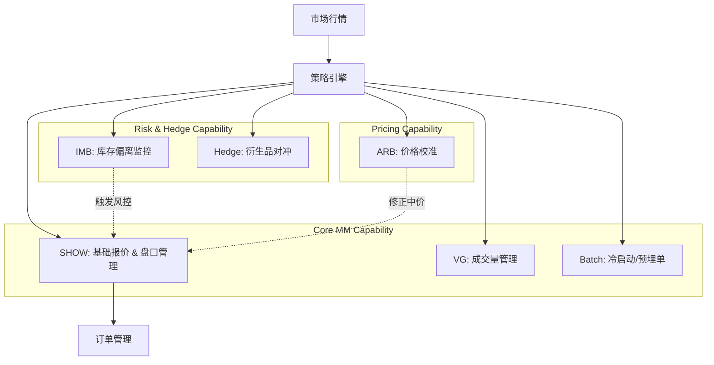

# Web3 量化交易系统设计：基于能力域（Capability Domains）的做市与套利工程实践

> **摘要**：本文聚焦于加密货币量化交易的系统架构与业务设计。有别于传统的策略罗列，我们从**领域驱动设计（DDD）**视角出发，将 Web3 量化系统抽象为执行、做市与定价三大核心能力域。文章详细拆解了从**做市商策略组（Strategy Stack）**、**执行算法（Algo-Trading）**到**风控体系**的完整工程实践，为构建高可用的 Web3 交易系统提供参考蓝图。

---

## 一、Web3 量化交易的业务图谱

### 1.1 为什么 Crypto 市场需要不同的量化架构？
与传统金融（TradFi）相比，加密货币市场（Crypto）的基础设施差异决定了量化系统的设计必须具备极高的韧性与实时性。

| 维度 | 传统金融市场 (TradFi) | 加密货币市场 (Crypto) | **系统设计挑战** |
| :--- | :--- | :--- | :--- |
| **时空连续性** | 固定交易时段 (4-8小时) | **7×24h 不间断 / 全球化** | 系统需具备“热更新”与无状态恢复能力 |
| **市场拓扑** | 单一主要交易所 | **CEX (离散) + DEX (链上) 并存** | 需处理多路异构数据源与网络延迟差异 |
| **流动性特征** | 集中且深厚 | **碎片化、长尾效应显著** | 需具备跨市场流动性聚合与拆单能力 |
| **结算最终性** | T+1 / T+2 | **准实时 (CEX) / 区块确认 (DEX)** | 资金流转效率高，但回滚风险（Reorg）需处理 |

这些特征要求 Web3 量化系统必须从“单点策略”进化为**“分布式能力网络”**。

### 1.2 三大核心能力域 (Capability Domains)
为了应对上述挑战，我们将系统解耦为三大正交的能力域，各司其职又相互协作：

*   **🛡️ 流动性与做市能力 (Liquidity & Market Making)**
    *   **定位**：市场的“基础设施”，保障资产**随时可买、随时可卖**。
    *   **核心指标**：盘口价差 (Spread)、挂单深度 (Depth)、在线时长 (Uptime)。
    *   **典型实现**：做市策略组（如 SHOW、VG），通过 limit order 提供被动流动性。

*   **⚡ 执行算法能力 (Execution & Algo-Trading)**
    *   **定位**：大额订单的“执行官”，对标传统金融的 EMS。
    *   **核心指标**：滑点 (Slippage)、冲击成本 (Impact Cost)、VWAP 偏离度。
    *   **典型实现**：EAAS (Execution as a Service)，提供 TWAP、Iceberg 等拆单算法。

*   **⚖️ 定价与套利能力 (Pricing & Arbitrage)**
    *   **定位**：跨市场的“审计员”与“搬运工”。
    *   **核心指标**：无风险收益率、价格收敛速度。
    *   **典型实现**：跨所套利、三角套利、期现基差回归。

---

## 二、MM 做市商体系：策略模块化实践
做市商（Market Maker）是流动性的源头。在工程落地中，我们将复杂的做市行为拆解为一组可插拔的**微策略模块（Micro-Strategies）**。

### 2.1 策略模块矩阵与协同架构
以下是业界验证的一套模块划分参考：

### 2.2 关键策略模块详解

#### **A. SHOW 策略：日常做市中枢 (Core Engine)**
**功能**：维护盘口结构（Order Book Shape）。
**核心机制**：
*   **价格锚定 (Anchoring)**：通过 WebSocket 订阅 Binance/OKX 等头部交易所价格作为 `fair_price`，防止本地价格被攻击。
*   **多层挂单 (Layering)**：在 `fair_price ± spread` 处构建阶梯式流动性（例如 ±0.1%, ±0.3%, ±0.5%）。
*   **弹性恢复 (Elasticity)**：当单侧挂单被吃掉后，依据冷却时间（Cool-down）动态补单，避免在单边下跌中接飞刀。

#### **B. VG 策略：流动性塑形 (Volume Generation)**
**功能**：满足项目方或交易所的活跃度（Active Liquidity）要求。
**核心机制**：
*   **目标拆解**：将日均交易量目标（Daily KPI）分解为分钟级目标。
*   **随机游走**：在时间和数量上引入泊松分布或随机扰动，使成交曲线符合真实市场特征，通过自对冲或利用自然流量补足缺口。

#### **C. IMB 策略：库存平衡 (Inventory Management Balance)**
**功能**：做市商的“止损阀”。库存倾斜是做市商最大的风险来源。
**逻辑流**：
1.  **监控**：实时计算库存比例 `Ratio = Base_Value / Total_Value`。
2.  **判定**：设定阈值（如 40%~60% 为安全区）。
3.  **纠偏**：
    *   *轻度偏离*：调整 SHOW 策略的报价倾斜（Skew），如库存过多则降低卖单价格（更易成交）、提高买单价格。
    *   *重度偏离*：触发 Hedge 模块或停止单边报价。

#### **D. Hedge 策略：Delta Neutral 对冲**
**功能**：消除贝塔（Beta）风险，赚取纯粹的价差收益。

**场景**：现货做市，利用永续合约（Perp）对冲。

**关键点**：需处理**资金费率（Funding Rate）**成本，智能选择在费率有利时进行对冲，甚至转化为“费率套利”策略。

---

## 三、EAAS 执行体系：从 Alpha 到执行细节

EAAS (Execution Algorithm as a Service) 旨在将人类的交易意图转化为最优的机器执行路径，特别是在流动性较差的币种上。

### 3.1 经典算法的 Web3 适配

| 算法 | 定义与 Web3 适配点 | 适用场景 |
| :--- | :--- | :--- |
| **TWAP** | **时间加权平均**。将订单切分到时间切片中执行。 *适配*：需考虑 CEX API 频率限制（Rate Limit）与链上 Gas 波动。 | 低波动、大额建仓/减仓 |
| **VWAP** | **成交量加权平均**。跟随市场成交热度，热度高多买，热度低少买。 *适配*：需清洗刷量数据，识别真实流动性分布。 | 降低对市场价格的冲击 |
| **Iceberg** | **冰山订单**。Display Size 只显示 1/N。 *适配*：在 L2 数据中可能会被侦测算法识别，需加入随机化 Display Size。 | 隐藏大户意图，防 Front-running |
| **Sniper** | **狙击/扫单**。仅在探测到特定流动性出现时瞬间吃单。 *适配*：常用于链上抢开盘或 CEX 插针时抄底。 | 极高波动或特定事件驱动 |

### 3.2 智能路由 (Smart Order Routing)
在 Web3 语境下，执行能力还包含了**SOR**：
*   **CEX 侧**：当多个交易所都有该币种时，自动比较 `Price + Fee + Slippage`，将大单拆分到 Binance、OKX、Bybit 同时执行。
*   **DEX 侧**：类似 1inch/Paraswap 的逻辑，在不同 AMM 池（Uniswap V3, Curve）之间寻找最优路径。

---

## 四、定价与套利：市场的纠偏者

### 4.1 基础套利模型
*   **跨所套利**：捕捉 CEX A 与 CEX B 的价差。
*   **三角套利**：如 `USDT -> ETH -> BTC -> USDT` 路径上的定价失效。

### 4.2 进阶：期现基差 (Basis Trading)
利用现货与永续合约的价格差（Basis）。
*   **正基差（Contango）**：买入现货 + 做空合约 -> 赚取资金费率 + 基差收敛。
*   **负基差（Backwardation）**：卖出/借币卖出现货 + 做多合约 -> 市场恐慌时的典型操作。
*   *风险提示*：需高度关注交易所的**穿仓分摊（ADL）**风险和借币利率波动。

### 4.3 链上特有：MEV 与原子性套利
在 DEX 场景下，套利策略演变为对 **Mempool (内存池)** 的竞争：
*   利用智能合约的**原子性 (Atomicity)**：如果套利路径中有一环失败，整个交易回滚。这是相对于 CEX 套利最大的优势（无腿部风险）。
*   **Sandwich Attack & Back-running**：虽然属于灰产地带，但从技术角度是典型的博弈论定价实践。

---

## 五、风控体系：系统的生命线

在 7×24h 的市场中，风控必须是**自动化且强制执行的**。

1.  **预审风控 (Pre-trade)**：
    *   **Fat Finger Check**：单笔下单金额不得超过资产的 X%。
    *   **Price Band**：下单价格不得偏离盘口 Y%。
2.  **盘中风控 (On-trade)**：
    *   **库存熔断**：IMB 策略失效时，强平部分仓位。
    *   **API 异常监测**：连续 N 次请求超时，立即停止策略并报警（防止网络延迟导致重复下单）。
3.  **账户级风控 (Account Level)**：
    *   **Kill Switch**：当账户净值回撤达到阈值（如 5%），物理级切断所有 API 权限，清空挂单。
    *   **交易所信用风险**：分散资金，监控交易所充提状态，利用 Nansen 等工具监控交易所链上热钱包流出情况。

---

## 六、结语

Web3 量化系统的设计本质上是在**吞吐量、延迟与风险**之间寻找动态平衡。
*   **对于做市**：核心在于构建“稳健的库存管理”与“弹性的报价策略”。
*   **对于执行**：核心在于隐匿意图与降低冲击。
*   **对于套利**：核心在于速度与费率计算的精确性。

随着 DeFi 的深化，未来的量化能力域将进一步融合**链上互操作性**与**AI 驱动的预测模型**，但本文所述的**执行、做市、定价**三大支柱，依然是构建一切复杂策略的基石。
